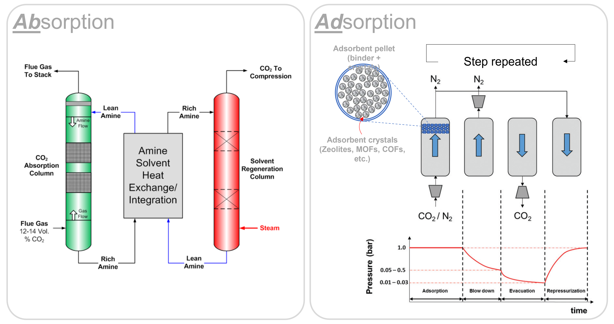
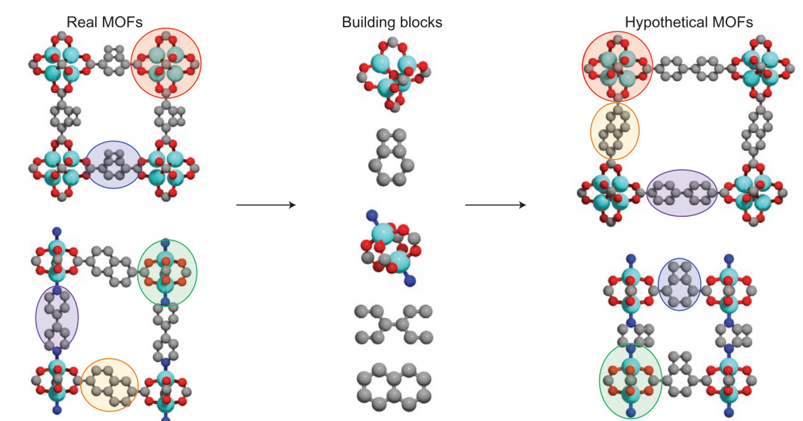
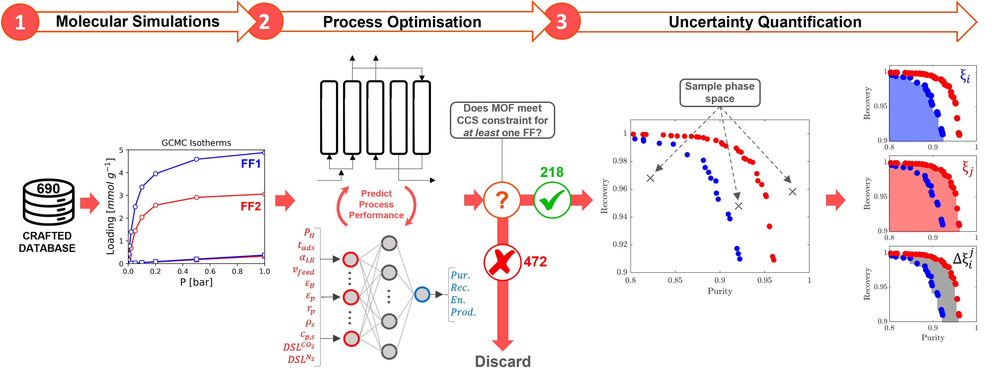
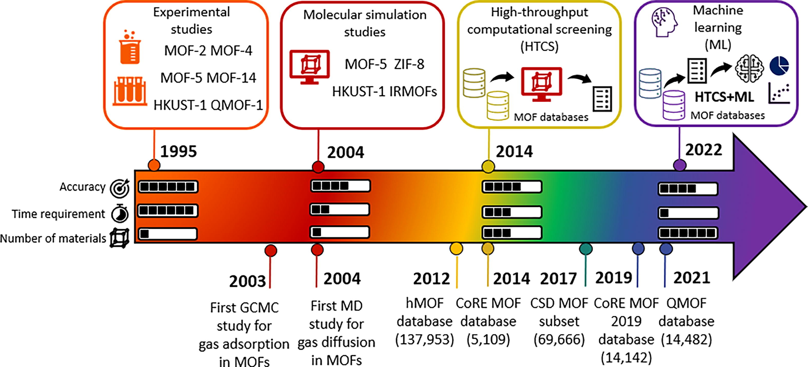

<!-- Can we accurately screen MOFs for carbon capture applications using high throughput computational screening workflows?    -->

<!--more-->

To reach "net zero", humanity <i>must act now</i> to reduce the levels of CO2 in the atmosphere. Carbon capture and sequestration (CCS) technologies are needed to achieve this, but the challenge lies in the additional energy and financial costs associated with the process. Chemical <u>ab</u>sorption using amine solvents are the currently preferred technologies for (post-combustion) carbon capture, however <u>ad</u>sorption using solid adsorbents have emerged as an energy-efficient alternative to absorption processes due to their low regeneration energy, high CO2 selectivity, and high CO2 capture capacity. 

<figure>
  
  <figcaption>Fig.1 - Absorption vs Adsorption processes for post-combustion carbon capture. On the left, a schematic depiction of a traditional amine-based absorption process is shown. The combustion flue gas enters an absorber reactor and flows countercurrently to a CO2-lean solvent where CO2 is absorbed into, and reacts with, the amine to form water-soluble compounds. On the right, an example of a pressure swing adsorption process is shown. Four steps comprise this cycle, including (from left to right) an adsorption, blowdown, evacuation, and pressurisation step. Left image source: DOE/NETL CARBON CAPTURE PROGRAM—CARBON DIOXIDE CAPTURE HANDBOOK. Right image source: adapted from Farmahini et al., <i>Energy. Env. Sci.</i>, (2020), <b>13</b>, 2</figcaption>
</figure>

One of the major advantages of adsorption technologies is routed in its cyclic nature: one can configure a variety of ‘cycles’ with different sequences and steps to achieve the best separation performance for a given CO2 capture source. Pressure swing adsorption (PSA), for example, works by cycling the pressure of a gas mixture between high and low pressures. The adsorbent selectively captures CO2 molecules when the pressure is high and releases them when the pressure is low. This cycle is repeated multiple times, allowing the adsorbent to capture a significant amount of CO2 from industrial flue gases, or even from the atmosphere!

At the heart of the adsorption process is the material used as an adsorbent. The efficiency of the process critically depends on the characteristics of this material (among other things). So, an important question to ask is: <i>for a given CO2 emission sector, can we find the best adsorbent?</i> Amongst the pool of porous materials that exist, this endeavour is akin to finding a needle in a haystack. Yet, the demand for CCS has prompted many research groups to pose, and attempt to answer, this exact question. Quite often the focus of these studies is the subclass of porous materials known as MOFs, a.k.a., metal organic frameworks. These materials are constructed from organic linkers and inorganic metal node complexes in a lego-like fashion (Fig.2).

<figure>
  
  <figcaption>Fig.2 - Real MOFs can be deconstructed into their constituent building blocks using digital reticular chemistry, and these building blocks can be used to generate new MOF structures with different functional properties. Image source: Wilmer et al., <i>Nat. Chem.</i>, (2012), <b>4</b>, 2</figcaption>
</figure>

 Currently, over 100,000 experimentally synthesised MOFs have been reported in the Cambridge Structural Database. But, by virtue of their modular nature, the number of possible MOF structures, chemistries, and therefore properties, are virtually infinite. Obviously, testing each of these materials using traditional trial-and-error experimentation is too costly and time consuming to be practical, and so we rely on computational tools to sift through these structures and identify the most promising MOFs for various applications. 

 These computational screening workflows typically depend on the use of molecular simulation to obtain thermodynamic and kinetic properties of systems that may be hard or even impossible to measure through experiment. The data obtained using these simulation techniques can be used to rank MOFs by their ability to selectively adsorb CO2 over N2, for example. However, concurrent developments in both molecular simulations and advanced process simulations have led to carbon capture community to the following proposition: <i> what if the screening of porous materials for dynamic adsorption processes can be implemented using realistic process simulations while the microscale properties of materials are provided by molecular simulations?</i> This multiscale screening protocol provides a more realistic approach to material selection (Fig.3).
 
 <figure>
  
  <figcaption>Fig.3 - Multiscale workflow concepts in vacuum swing adsorption (VSA) and pressure swing adsorption (PSA) engineering. The starting point of the workflow is the structure of the porous material (either experimental or hypothetical, on the left). Molecular simulations are used to obtain equilibrium adsorption and kinetics data. Process simulations are performed for various cycle configurations. Finally, on the right, performance of the material is assessed in terms of energy (E)−productivity (Pr) trade-offs, with the red arrow in the graph indicating progression of this assessment toward the Pareto front (dashed red line). Image source: Farmahini et al., <i>Chem. Rev.</i>, (2021), <b>121</b>, 17</figcaption>
</figure>
 
 Okay, let's break this approach down. Starting with a MOF crystal structure, we use a simulation technique called Grand Canonical Monte Carlo (GCMC) to see how well a material can adsorb CO2 over other gaseous components in a gas mixture. In other words, we compute the adsorption equilibrium (or isotherm) between the MOF and all gaseous species. Then, we use this data to create a model of how the material would work in a real-world CO2 capture process. We adjust different variables of the PSA cycle, like pressure and cycle duration, to find the best combination of process parameters for the material. We are trying to balance different objectives during this adjustment, like achieving high productivity (moles of CO2 captured per kg of adsorbent per second) while using the least amount of energy (kWh per tonne of CO2 captured). These objectives are in competition with one another: in order to achieve high productivity, we have to use more energy. We therefore represent the energy-productivity trade-off using a Pareto front (Fig.3 on the right). This curve defines the best possible performance of a material in a given PSA process. Points to the top left of this curve are sub-optimal process configurations, and points to the bottom right of this curve are impossible to achieve. We can then compare the Pareto fronts for two different materials to see which one works best.
 
 This is a fairly clean representation of a multiscale screening workflow. However, many design choices took place behind the scenes. One of them was choosing how to generate the adsorption data using molecular simulations, which is a crucial first step in the simulation pipeline. But how do we even simulate adsorption in MOFs, and why is it so important for computational screening? 

 Well, to predict how MOFs capture CO2, the interactions between the MOF and CO2 must be accurately described. This is done through a set of equations and molecular parameters called a <i>forcefield</i>. In particular, we (as a minimum) must be able to describe the short-range dispersion / repulsion interactions and the long-range electrostatic interactions. A <i>Lennard-Jones potential</i> (which requires two molecular parameters per element) and a <i>Coulomb potential</i> (which can be resolved by calculating partial charges for each atom in the simulation system) can be used to simulate the short-range and long-range interactions, respectively. Therefore, our forcefield is defined as a combination of parameters for the Lennard-Jones (LJ) potential and a protocol to calculate the partial charges. Common choices include the UFF or Dreiding LJ parameter sets, in combination with partial charges assigned by either quantum mechanical calculations (such as the DDEC method) or by charge equilibration schemes (such as the Qeq and EQeq methods).The choices made at the molecular level will influence the process-level predictions, and therefore the final recommendations which emerge from multiscale computational screening studies.

<figure>
  
  <figcaption>Fig.4 - <b>High throughput computational screening workflow with uncertainty quantification</b>. For a single MOF, comparing two different molecular forcefields <i>i</i> and <i>i</i>  involves the following steps. In step (1) the CO2 and N2 adsorption isotherms are predicted using molecular simulations. In step (2), the GCMC adsorption data is used to generate CO2 purity-recovery Pareto fronts or energy penalty-productivity Pareto fronts using an artificial neural network (ANN) surrogate model. If the constraints for carbon capture (CO2 purity and recovery &#8805 0.9) are satisfied for at least one forcefield, then all of the ANN-generated Pareto fronts are refined using the PSA process model. If the constraints are not satisfied for any forcefield combination, then the MOF is discarded from our uncertainty quantification study. In step (3), the hypervolume ξ of each Pareto front <i>i</i> and <i>j</i> is determined by stochastically sampling the Pareto phase space, i.e., the blue and red shaded regions in the right-most subplots. The hypervolume error between forcefields <i>i</i> and <i>j</i> for a single material at the Pareto level is taken as the difference in these two shaded regions, as shown by the grey shaded region in the right-bottom subplot.</figcaption>
</figure>
 
 In light of these considerations, we asked in a recent study: can we trust the material rankings from high throughput screening of porous materials for carbon capture based on off-the shelf molecular forcefields? To explore these issues, we computationally screened the performance of 690 MOFs using a multiscale workflow with integrated uncertainty quantification (Fig.4). We generated distributions of CO2 and N2 adsorption behaviours in each of these MOFs by performing molecular simulations using different combinations of the LJ parameter sets and partial charge assignment methods. Using this data, we evaluated how the performance of materials, and therefore the final rankings obtained using process simulation, changes using different forcefields. 

 

 <figure>
  
  <figcaption>Fig.5 - A timeline of major milestones in computational MOF research. The number of black boxes inside the arrow comparatively represents the accuracy of the corresponding method, time requirement to obtain target properties, and the number of materials that can be studied using that method (experiments, molecular simulations, HTCS and HTCS + ML). The numbers in the parenthesis for the databases represent the number of materials in these databases. Image source: Demir et al., <i>Coord. Chem. Rev.</i>, (2023), <b>484</b></figcaption>
</figure>
