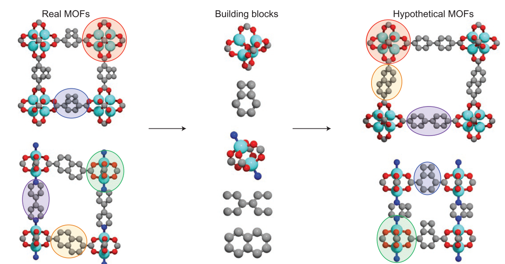

<!-- Can we accurately screen MOFs for carbon capture applications using high throughput computational screening workflows?    -->

<!--more-->

To reach "net zero", humanity <i>must act now</i> to reduce the levels of CO2 in the atmosphere. Carbon capture and sequestration (CCS) technologies are needed to achieve this, but the challenge lies in the additional energy and financial costs associated with the process. <u>Ad</u>sorption separations are energy-efficient alternatives to traditional <u>ab</u>sorption processes which use amine-based solutions, but their efficiencies depend on (among other things) the characteristics of the material used as an adsorbent. Recently, several families of porous materials such as ZIFs, COFs, and MOFs, have been discovered, and research efforts have been focused on identifying new materials with superior characteristics for adsorption-based CCS applications. 

The questions is, <i>for a given CO2 emission sector, can we find the best adsorbent?</i> Amongst the existing pool of porous materials, this endeavour is akin to finding a needle in a haystack. Yet, the demand for CCS has prompted many research groups to pose, and attempt to answer, this exact question. Quite often the focus of these studies is the subclass of porous materials known as MOFs, a.k.a., metal organic frameworks. These materials are constructed from organic linkers and inorganic metal node complexes in a lego-like fashion (Fig.1).

<figure>
  
  <figcaption>Fig.1 - Real MOFs can be deconstructed into their constituent building blocks using digital reticular chemistry, and these building blocks can be used to generate new MOF structures with different functional properties. Source: Wilmer et al., <i>Nat. Chem.</i>, (2012), <b>4</b>, 2</figcaption>
</figure>

 Currently, over 100,000 experimentally synthesised MOFs have been reported in the Cambridge Structural Database. However, by virtue of their modular nature, the number of possible MOF structures, chemistries, and therefore properties, are virtually infinite. Obviously, testing each of these materials using experiments is too costly and time consuming to be practical, and so we rely on high throughput computational screening (HTCS) as a tool to sift through these structures and identify the most promising MOFs for various applications. Concurrent developments in both molecular simulations and advanced process simulations led researchers in the field to the following proposition: <i> what if the screening of porous materials for dynamic adsorption processes can be implemented using realistic process simulations while the microscale properties of materials are provided by molecular simulations?</i> This multiscale screening protocol is schematically depicted in Fig.2. 
 
 <figure>
  
  <figcaption>Fig.2 - Multiscale workflow concepts in vacuum swing adsorption (VSA) and pressure swing adsorption (PSA) engineering. The starting point of the workflow is the structure of the porous material (either experimental or hypothetical, on the left). Molecular simulations are used to obtain equilibrium adsorption and kinetics data. Process simulations are performed for various cycle configurations. Finally, on the right, performance ofthe material is assessed in terms of energy (E)−productivity (Pr) trade-offs, with the red arrow in the graph indicating progression of this assessment toward the Pareto front (dashed red line). Image source: Farmahini et al., <i>Chem. Rev.</i>, (2021), <b>121</b>, 17</figcaption>
</figure>
 
  This approach requires three things, primarily:  
<ol>
  <li><i>Database of MOF candidates to evaluate</i></li>
  <li><i>Property data which describes the material in cyclical adsorption processes</i></li>
  <li><i>A numerical model which simulates the cyclical adsorption process</i></li>
</ol>
 

